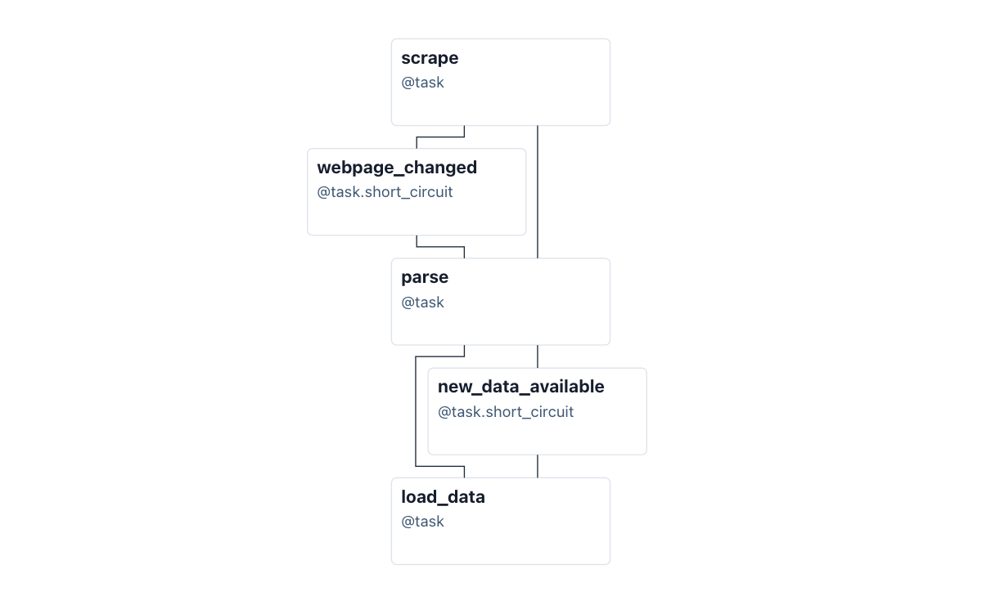
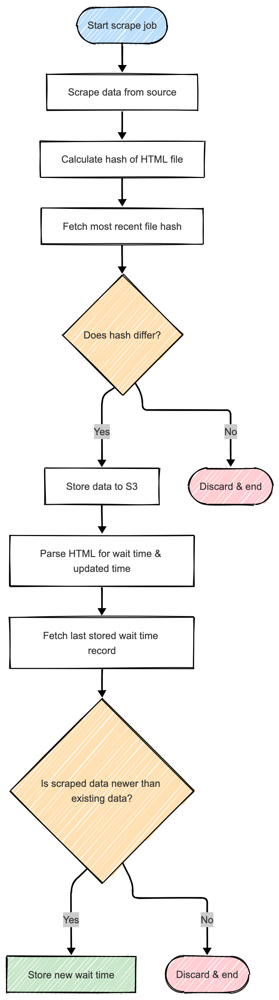

# Open Wait Times

Open Wait Times is an ETL pipeline designed to scrape, parse, and archive emergency room wait times from hospitals in London, Ontario. I built this project to demonstrate a robust, scalable approach to collecting real-time data via [Apache Airflow](https://airflow.apache.org/) for historical analysis and visualization via [Apache Superset](https://superset.apache.org/).

## Architecture

The system follows a modular ETL pattern. The pipeline runs every 10 minutes, a frequency chosen to create a safety margin around the hospitals' 15-minute update cycle. If a fetch failed after 3 retries, either due to network issues or problems at the source, the system still has another opportunity to collect the data before the source updates again, preventing gaps in the timeline. Raw HTML is archived in S3-compatible storage ([Garage S3](https://git.deuxfleurs.fr/Deuxfleurs/garage)) to ensure data lineage, while the structured data is immediately available for analysis and visualization in Apache Superset.

    

## The ETL Pipeline

Apache Airflow orchestrates the workflow. Rather than hard-coding pipelines for each hospital, I implemented a dynamic DAG generator. The system reads from a `manifest.yaml` configuration file and automatically generates the necessary DAGs. This design allows for easy extensibility; adding a new hospital only requires a configuration entry and a specific scraper class.

    

The pipeline will first fetch raw HTML from source and compare its SHA-256 hash with the last stored webpage. If the webpage hasn't changed, then it will terminate the pipeline to avoid unnecessary compute costs. Otherwise, it will then proceed to parse the scraped data, and then compare it with the most recently updated data in the databse. If the scraped data already exists or is older, then the scraped data is discarded.  Finally, if the scraped data is new, it will store the new data into the database.

    

### Key Features

1. **Efficiency via Shortcircuits** -- To minimize costs, the scraper halts if the content hash (SHA-256) is unchanged. It also validates new data against existing records, skipping database writes for duplicate or stale entries

2. **Auditable Data Lineage** -- Every scrape attempt is logged in the database with its status code and content hash. The raw HTML is preserved, ensuring that the derived data can always be verified against the source

**Structured Data Model**
The PostgreSQL database uses a normalized schema:
- `hospital_metadata`: Registry of monitored locations
- `fetch_logs`: An audit trail of every execution
- `er_wait_times`: The clean time-series data (wait duration, calculated patient arrival/departure times)

## Tech Stack

- **Infrastructure**: [PVE](https://proxmox.com/en/), [Debian 13 Trixie](https://www.debian.org/), [Docker](https://www.docker.com/)
- **Orchestration**: [Apache Airflow](https://airflow.apache.org/)
- **Database**: [PostgreSQL 18](https://www.postgresql.org/)
- **Storage**: [Garage S3](https://git.deuxfleurs.fr/Deuxfleurs/garage)
- **Visualization**: [Apache Superset](https://superset.apache.org/)
- **Language**: [Python 3](https://www.python.org/)
- **Libraries**: [httpx](https://github.com/encode/httpx/), [pandas](https://github.com/pandas-dev/pandas), [pendulum](https://github.com/python-pendulum/pendulum)

## Potential Areas of Improvements

1. Expand the dataset to include more Ontario hospitals and continue refining the Superset dashboards to uncover deeper insights into ER wait times
2. Pull the most recently updated data from XCOM instead of from database for `new_data_available` short circuit check to make the pipeline faster and reduce the number of database requests (which could be expensive if hosted on a cloud platform)
3. Create an interactive dashboard with React/Plotly to make the visualization layer more flexible
